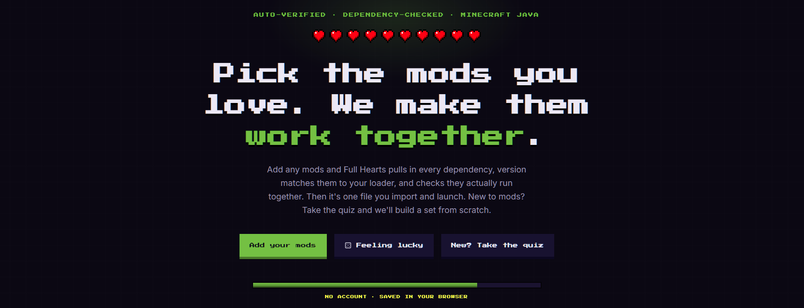

# Minecraft Server (Forge 1.20.1)

A whitelist-only, hardened Minecraft server for kids and their approved friends.
Only players you add can join. See `docker-compose.yml` for all safety settings.

## ENTER HERE:[EduCraft](https://fullhearts.app/)

## Players join with the mod pack
- Installed immediatly in the server, none needed by the player thanks to [FULL_HEARTS](https://fullhearts.app/) !!!

## Who can play (the safety control)

Only whitelisted usernames can join. Contact: https://fullhearts.app/
